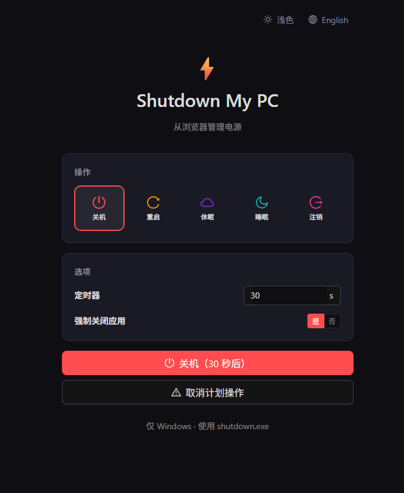

# 💻 Shutdown My PC

> ブラウザから Windows の電源操作を管理 — シャットダウン、再起動、休止状態、スリープ、ログオフを実行できるダークテーマの Web UI。

[English](README.md) · [中文](README.zh-CN.md) · 🌐 **日本語**



## 🎯 背景

**Wake-on-LAN (WOL)** を使えばリモートで PC の電源を入れるのは簡単ですが、**リモートで電源を切る**のはまだ面倒です — 通常は RDP でログインし、ターミナルやスタートメニューを開いて手動でシャットダウン操作を行う必要があります。これは不便で時間がかかり、たった一つのコマンドを実行するだけのためにデスクトップセッション全体を占有します。

**Shutdown My PC** は、ネイティブの `shutdown.exe` コマンドを実行するクリーンな Web インターフェースを提供することでこの問題を解決します。特に以下のようなケースで役立ちます：

- **ヘッドレスデスクトップ / メディアサーバー** — WOL で起動できるが簡単にシャットダウンできない
- **ホームラボマシン** — RDP 不要でリモートから電源オフ
- **リモートストリーミング用のゲーミング PC** — セッション終了後にログインせずにシャットダウン

プログラムを **Windows スタートアップ** に登録すれば、PC の電源が入っている限り自動的に Web UI が利用可能になります。RDP もリモートデスクトップも不要 — ブラウザのタブを開くだけです。

> 🔒 **セキュリティ注意：** このツールは HTTP 経由で電源管理コマンドを公開します。**直接インターネットに公開しないでください。** **VPN**（Tailscale、WireGuard、OpenVPN）を使用してリモートアクセスするか、**リバースプロキシ**（NGINX、Caddy）の背後に**ベーシック認証**や **OAuth2** ミドルウェアを配置してください。

## ✨ 機能

- **5 種類の電源操作** — シャットダウン、再起動、休止状態、スリープ、ログオフ
- **カスタムタイマー** — 0〜600 秒（10 分）のカウントダウンを設定
- **強制終了** — 実行中のアプリケーションを強制的に閉じる（オプション）
- **予約操作のキャンセル** — ボタン一つで保留中のシャットダウンを中断
- **ダークテーマ** — [Ant Design 5](https://ant.design/) とカスタム CSS によるモダンな暗色 UI
- **Bun ベース** — 高速なオールインワン JavaScript ランタイム [Bun](https://bun.sh) で構築
- **単一実行ファイル** — 1 つの `.exe` ファイルにトレイアイコンとサーバーを内蔵
- **ポート競合処理** — ポート 3021 が使用中の場合は新しいポートを入力するダイアログを表示
- **単一インスタンス** — 同時に 1 つのインスタンスのみ実行

> **注意：** 電源管理 API（`shutdown.exe`）は **Windows 専用** です。他のプラットフォームではエラーを返します。

## 🚀 はじめに

### 前提条件

- [Bun](https://bun.sh) v1.x がインストールされていること
- **Windows**（電源 API 機能用；UI は他のプラットフォームでも表示されます）

### インストール

```bash
bun install
```

### 開発モード

ホットモジュールリプレイス（HMR）付きで開発サーバーを起動：

```bash
bun dev
```

サーバーはデフォルトで `http://localhost:3021` で起動します。  
`PORT` 環境変数または CLI 引数でポートを変更：

```bash
PORT=8080 bun dev
# または
bun dev 8080
```

### プロダクションビルド

フロントエンドアセットをビルドし、スタンドアロン実行ファイルをコンパイル：

```bash
bun run build          # 単一の out/ShutdownMyPC.exe を生成
```

ステップ実行：

```bash
bun run build:frontend # out/dist/ に出力
bun run build:exe      # out/shutdown-my-pc.exe にコンパイル
```

プロダクションサーバーを起動：

```bash
bun start
```

プロダクションモードではサーバーが自動的にブラウザを開きます。

### 📌 Windows スタートアップに登録

PC 起動時に自動的に Web UI を使えるようにするには：

1. **Win + R** を押し、`shell:startup` と入力して Enter を押し、**スタートアップ** フォルダを開きます。
2. `out/ShutdownMyPC.exe` へのショートカットを作成します。
3. これで毎回起動時にサーバーとトレイアイコンが自動的に起動します。

以降、PC の電源が入っている間はサーバーがバックグラウンドで動作し、`http://<PCのIP>:3021/` でローカルネットワーク上の任意のデバイスから UI にアクセスできます。

## 🔒 セキュリティ（重要）

このツールは **ローカルネットワークでの使用** を想定しています。API エンドポイントは認証なしでリクエストを受け付けるため、ポートにアクセスできる人は誰でも PC をシャットダウンできます。

| アクセス方法 | 推奨 |
|-------------|------|
| **同一 LAN** | ✅ 安全 — 追加設定不要 |
| **リモート / インターネット** | ❌ **直接公開しないでください** — 必ず以下のいずれかの方法を使用 |

### 方法 A：VPN（推奨）

VPN（**Tailscale**、**WireGuard**、**OpenVPN** など）経由でホームネットワークに接続し、ローカル IP で UI にアクセスします。ポートを開放する必要はありません。

### 方法 B：リバースプロキシ + 認証

**NGINX**（または Caddy、HAProxy）をベーシック認証付きのリバースプロキシとして使用：

```nginx
server {
    listen 443 ssl;
    server_name shutdown.example.com;

    ssl_certificate     /path/to/cert.pem;
    ssl_certificate_key /path/to/key.pem;

    location / {
        auth_basic           "Restricted";
        auth_basic_user_file /etc/nginx/.htpasswd;

        proxy_pass http://127.0.0.1:3021;
        proxy_set_header Host $host;
        proxy_set_header X-Real-IP $remote_addr;
    }
}
```

`.htpasswd` ファイルを生成：

```bash
echo "user:$(openssl passwd -apr1)" > /etc/nginx/.htpasswd
```

## 📖 API リファレンス

### `GET /api/power`

電源操作を実行します。

**クエリパラメータ：**

| パラメータ | 型      | デフォルト   | 説明 |
|-----------|---------|-------------|------|
| `action`  | string  | `shutdown`  | 次のいずれか：`shutdown`、`restart`、`hibernate`、`sleep`、`logout` |
| `timeout` | number  | `30`        | 遅延秒数（0–600）。`logout` では無視。 |
| `force`   | boolean | `true`      | 実行中のアプリケーションを強制終了するかどうか。`logout` では無視。 |

**レスポンス：**

```json
{
  "ok": true,
  "action": "shutdown",
  "message": "Shut down in 30 seconds"
}
```

エラーレスポンス：

```json
{
  "ok": false,
  "error": "Unknown action \"reboot\". Valid: shutdown, restart, hibernate, sleep, logout"
}
```

---

### `GET /api/cancel`

現在予約されている電源操作をキャンセルします（`shutdown -a` と同等）。

**レスポンス：**

```json
{
  "ok": true,
  "message": "Scheduled operation has been cancelled"
}
```

## 🧱 技術スタック

| 層       | 技術 |
|----------|------|
| ランタイム | [Bun](https://bun.sh) |
| フロントエンド | React 19 + TypeScript |
| UI      | Ant Design 5 + @ant-design/icons |
| スタイリング | カスタム CSS + CSS カスタムプロパティ |
| トレイ   | C# (System.Windows.Forms) |
| バンドル | Bun 内蔵バンドラー + HMR |

## 📁 プロジェクト構成

```
shutdown-my-pc/
├── screenshots/
│   └── screenshots.png
├── src/
│   ├── server/
│   │   └── utils.ts        # サーバーユーティリティ（ポート、シャットダウン、静的ファイル）
│   ├── App.tsx              # メイン React コンポーネント
│   ├── frontend.tsx         # React エントリポイント
│   ├── index.css            # グローバルスタイル
│   ├── index.html           # HTML テンプレート
│   └── index.ts             # サーバーエントリポイント + API ルート
├── tray/
│   ├── TrayApp.cs           # システムトレイラッパー（C#）
│   ├── tray-icon.ico        # カスタムトレイアイコン
│   └── ServerSize.cs        # build.js が自動生成
├── build.js                 # ビルドスクリプト
├── package.json
└── tsconfig.json
```

## 📄 ライセンス

MIT
