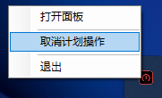

# 💻 Shutdown My PC

> 通过浏览器管理 Windows 电源操作 — 精美的深色主题界面，支持关机、重启、休眠、睡眠和注销。

[English](README.md) · 🌐 **中文** · [日本語](README.ja-JP.md)




## 🎯 动机

**Wake-on-LAN (WOL)** 可以轻松远程开机，但**远程关机**仍然很麻烦 — 通常需要 RDP 登录、打开终端或开始菜单，然后手动执行关机。这不方便、缓慢，仅仅为了执行一个命令却要占用整个桌面会话。

**Shutdown My PC** 通过提供一个简洁的 Web 界面来解决这个问题，它调用本机的 `shutdown.exe` 命令。特别适用于：

- **无头桌面 / 媒体服务器** — 通过 WOL 唤醒后无法方便关机
- **家庭实验室机器** — 无需 RDP 即可远程关闭
- **用于远程串流的游戏 PC** — 在会话结束后关机而无需登录

将程序设置为 **Windows 开机启动**，只要机器开着，Web UI 就会自动可用。无需 RDP、无需远程桌面 — 只需打开浏览器标签页。

> 🔒 **安全提示：** 此工具通过 HTTP 暴露电源管理命令。**切勿**直接暴露到公网。使用 **VPN**（Tailscale、WireGuard、OpenVPN）远程访问，或在前面放置**反向代理**（NGINX、Caddy）配合**基本认证**或 **OAuth2** 中间件。

## ✨ 功能特性

- **5 种电源操作** — 关机、重启、休眠、睡眠、注销
- **自定义倒计时** — 设置 0 到 600 秒（10 分钟）的延时
- **强制关闭应用** — 可选择强制关闭正在运行的程序
- **取消计划操作** — 一键取消任何待执行的关机
- **深色主题** — 基于 [Ant Design 5](https://ant.design/) 和自定义 CSS 的现代化深色界面
- **完全便携** — 单个 ~1 MB `.exe`，前端和 HTTP 服务器内嵌其中
- **无需运行时** — 内置 C# `HttpListener`，无需 Bun/Node.js
- **端口冲突处理** — 端口 3021 被占用时弹出对话框输入新端口
- **单实例运行** — 每次只允许一个实例运行

> **注意：** 电源管理 API（`shutdown.exe`）**仅支持 Windows**。

## 🚀 开始使用

### 下载

从 [Releases](https://github.com/kyuuseiryuu/shutdown-my-pc/releases) 下载最新的 `ShutdownMyPC.exe` — 无需安装。

### 从源码构建

#### 环境要求

- [Bun](https://bun.sh) v1.x（仅用于构建前端）
- **Windows**（需 .NET Framework 4.5+，现代 Windows 已预装）
- C# 编译器（`csc.exe`，随 .NET Framework 附带）

#### 构建

```bash
bun install
bun run build          # 构建单个 out/ShutdownMyPC.exe
```

输出是一个原生 Windows 可执行文件，所有前端文件都已内嵌其中。

### 📌 设置为 Windows 开机启动

1. 按 **Win + R**，输入 `shell:startup` 并回车，打开**启动**文件夹。
2. 创建 `ShutdownMyPC.exe` 的快捷方式。
3. 现在每次开机时托盘图标和服务器都会自动启动。

之后，你可以通过 `http://<你的电脑IP>:3021/` 从局域网任何设备访问界面。

## 🔒 安全性（重要）

此工具设计用于**局域网环境**。API 端点接受无认证的请求，所以任何能访问到端口的人都可以关闭你的电脑。

| 访问方式 | 建议 |
|---------|------|
| **同一局域网** | ✅ 安全 — 无需额外配置 |
| **远程 / 互联网** | ❌ **切勿直接暴露** — 务必使用以下方法之一 |

### 方案 A：VPN（推荐）

通过 VPN（如 **Tailscale**、**WireGuard**、**OpenVPN**）连接到家庭网络，使用机器的局域网 IP 访问界面。无需开放端口。

### 方案 B：反向代理 + 认证

使用 **NGINX**（或 Caddy、HAProxy）作为反向代理配合基本认证：

```nginx
server {
    listen 443 ssl;
    server_name shutdown.example.com;

    ssl_certificate     /path/to/cert.pem;
    ssl_certificate_key /path/to/key.pem;

    location / {
        auth_basic           "Restricted";
        auth_basic_user_file /etc/nginx/.htpasswd;

        proxy_pass http://127.0.0.1:3021;
        proxy_set_header Host $host;
        proxy_set_header X-Real-IP $remote_addr;
    }
}
```

生成 `.htpasswd` 文件：

```bash
echo "user:$(openssl passwd -apr1)" > /etc/nginx/.htpasswd
```

## 📖 API 参考

### `GET /api/power`

触发电源操作。

**查询参数：**

| 参数     | 类型    | 默认值     | 说明 |
|---------|---------|-----------|------|
| `action` | string | `shutdown` | 可选值：`shutdown`、`restart`、`hibernate`、`sleep`、`logout` |
| `timeout`| number | `30`       | 延迟秒数（0–600）。对 `logout` 无效。 |
| `force`  | boolean| `true`     | 是否强制关闭正在运行的程序。对 `logout` 无效。 |

**响应：**

```json
{
  "ok": true,
  "action": "shutdown",
  "message": "Shut down in 30 seconds"
}
```

错误响应：

```json
{
  "ok": false,
  "error": "Unknown action \"reboot\". Valid: shutdown, restart, hibernate, sleep, logout"
}
```

---

### `GET /api/cancel`

取消任何当前计划的电源操作（等同于 `shutdown -a`）。

**响应：**

```json
{
  "ok": true,
  "message": "Scheduled operation has been cancelled"
}
```

## 🧱 技术栈

| 层      | 技术 |
|---------|------|
| HTTP 服务器 | C# `HttpListener` (.NET Framework) |
| 前端    | React 19 + TypeScript |
| UI      | Ant Design 5 + @ant-design/icons |
| 样式    | 自定义 CSS + CSS 自定义属性 |
| 托盘    | C# `NotifyIcon` (System.Windows.Forms) |
| 打包    | Bun（仅用于前端构建） |

## 📁 项目结构

```
shutdown-my-pc/
├── screenshots/
│   └── screenshots.png
├── src/
│   ├── App.tsx              # 主 React 组件
│   ├── frontend.tsx         # React 入口
│   ├── index.css            # 全局样式
│   ├── index.html           # HTML 模板
│   └── index.ts             # 服务器入口（仅开发模式）
├── tray/
│   ├── Program.cs           # 入口 + 端口冲突检测
│   ├── TrayApp.cs           # 系统托盘封装 (NotifyIcon)
│   ├── HttpServer.cs        # HTTP 服务器 (HttpListener)
│   ├── PowerManager.cs      # shutdown.exe 封装
│   ├── StaticFiles.cs       # 内嵌文件存储
│   ├── EmbeddedFiles.cs     # 由 build.js 自动生成
│   └── tray-icon.ico        # 自定义托盘图标
├── build.js                 # 构建脚本（生成 EmbeddedFiles.cs，编译）
├── package.json
└── tsconfig.json
```

## 📄 许可证

MIT
